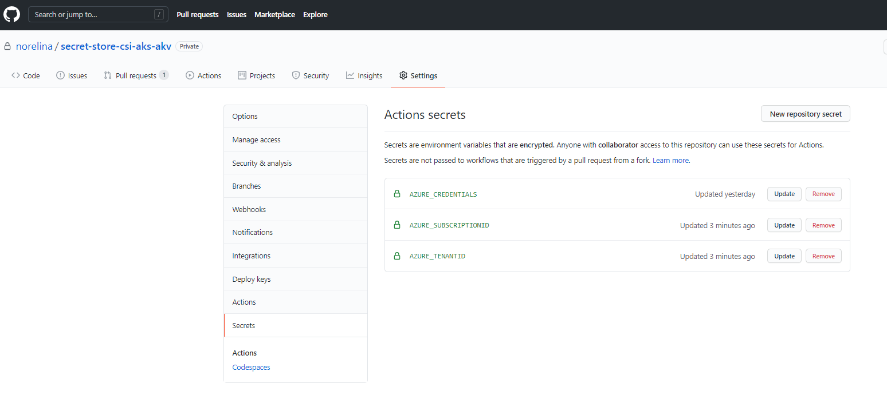

# Using Secrets Store CSI with Azure Kubernetes and Azure KeyVault

## Overview

This repo is a walkthrough of using the [Kubernetes Secrets Store CSI Driver](https://secrets-store-csi-driver.sigs.k8s.io/) as a mechanism to get secret contents stored in Azure Key Vault instance and use the Secret Store CSI driver interface to mount them into Kubernetes pods.

In this repo you can find a containerized Go sample app (deployed with [Helm](https://helm.sh/)) running in an AKS cluster (provisioned with ARM templates), all setup with a Github Actions workflow. The [workflow](.github\workflows\devops-workflow.yml) includes steps to:

- Provision an AKS Cluster and an Azure KeyVault
- Install the [Secrets Store CSI Driver and the Azure Keyvault Provider](https://azure.github.io/secrets-store-csi-driver-provider-azure/getting-started/installation/) using Helm
- Deploy a [SecretProviderClass Object](https://azure.github.io/secrets-store-csi-driver-provider-azure/getting-started/usage/#create-your-own-secretproviderclass-object) using Helm
- Deploy a sample Go app to the AKS cluster using Helm. The [deployment yaml is configured](Application\charts\sampleapp\templates\deployment.yaml) to use the Secrets Store CSI driver and reference the SecretProviderClass resource.

While the [Azure Key Vault provider of the CSI driver](https://azure.github.io/secrets-store-csi-driver-provider-azure/configurations/identity-access-modes/) offers 4 modes for accessing a KeyVault instance (Service Principal, Pod Identity, User-assigned Managed Identity, and System-assigned Managed Identity), this sample focused on using the `User-assigned Managed Identity`.

Here is the folder structure:

- `.github\workflows`
  - `devops-workflow.yml` - Github Actions Pipelines yaml file
- `Application`
  - `charts`
    - `sampleapp` - Helm chart for sample app
    - `secret-provider-class` - Helm chart for Secrets Store Provider Class
  - `app.go` - Go sample app
  - `Dockerfile` - Dockerfile for the sample app
- `ArmTemplates` - Arm Templates for provisioning aks, acr and application insights

While the infrastructure deployments and `using Secrets Store CSI with Azure Kubernetes and Azure KeyVault` steps are all automated in the `devops-workflow.yml`, here is an Azure documentation [Secrets Store CSI with Azure Kubernetes and Azure KeyVault](https://docs.microsoft.com/en-us/azure/key-vault/general/key-vault-integrate-kubernetes) that describes a manual walkthrough.

## Getting Started

### Prerequisites

- [Azure CLI](https://docs.microsoft.com/en-us/cli/azure/install-azure-cli?view=azure-cli-latest): Create and manage Azure resources.
- [Kubectl](https://kubernetes.io/docs/tasks/tools/install-kubectl/): Kubernetes command-line tool which allows you to run commands against Kubernetes clusters.
- [GitHub](https://github.com/) account

### Set up

1. Fork the repo to your github account and git clone.
2. Create a resource group that will hold all the provisioned resources and a service principal to manage and access those resources

    ```bash
    # Set your variables
    RESOURCEGROUPNAME="MyResourceGroup"
    LOCATION="MyLocation"
    SUBSCRIPTIONID="MySubscriptionId"
    SERVICEPRINCIPALNAME="MyServicePrincipalName"

    # Create resource group
    az group create --name $RESOURCEGROUPNAME --location $LOCATION

    # Create a service principal with Contributor role to the resource group
    az ad sp create-for-rbac --name $SERVICEPRINCIPALNAME --role Contributor --scopes /subscriptions/$SUBSCRIPTIONID/resourceGroups/$RESOURCEGROUPNAME --sdk-auth
    ```

3. Use the json output of the last command as a secret named `AZURE_CREDENTIALS` in the repository settings (Settings -> Secrets -> Add New Secret).

    Also add a secret named `AZURE_SUBSCRIPTIONID` for the subscription id and a secret named `AZURE_TENANTID` for the tenant id.

    

    For more details on generating the deployment credentials please see [this guide](https://docs.microsoft.com/en-us/azure/azure-resource-manager/templates/deploy-github-actions#generate-deployment-credentials).

4. [Github Actions](https://docs.github.com/en/actions) will be used to automate the workflow and deploy all the necessary resources to Azure. Open the [.github\workflows\devops-workflow.yml](.github\workflows\devops-workflow.yml) and change the environment variables accordingly. Update the `RESOURCEGROUPNAME` variable and set the value that you created above.

5. Commit your changes. The commit will trigger the build and deploy jobs within the workflow and will provision all the resources to run the sample application.

## Validate the Secrets

To validate that the secrets are mounted to the sampleapp pod in the AKS cluster from Azure KeyVault:

**# Note:** The expected secrets should be `test-secret-value`.

```bash
# Define variables
RESOURCEGROUPNAME="<insert-resource-group-name-here>"
CLUSTERNAME="<insert-cluster-name-here>"
NAMESPACE="<insert-sampleapp-namespace-name-here>"

# Connect to Cluster
az aks get-credentials --resource-group $RESOURCEGROUPNAME --name $CLUSTERNAME

# Get a pod name the app is running on
PODNAME=$(kubectl get pod -l app=sampleapp -o jsonpath="{.items[0].metadata.name}" -n $NAMESPACE)

# Exec into the pod
kubectl exec -it $PODNAME -n $NAMESPACE -- bash

# Verify the secrets
cd /mnt/secrets-store/
cat test-secret; echo
```
